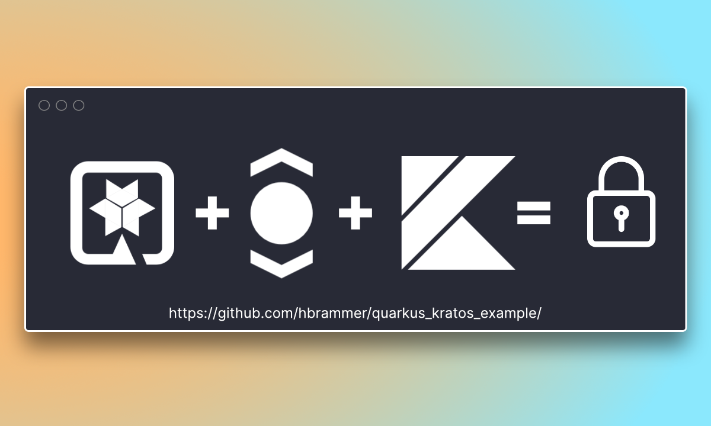

# Securing a Kotlin Quarkus app with Ory Kratos


This is the an example of how to secure a Quarkus app with Ory Kratos.

The full writeup can be found on my blog: [hauke.me](https://hauke.me/writing/2021-03-building-a-quarkus-application-with-ory-kratos/).

## A little warning
This code is by no means production ready! 
Please think at least thrice before you use it. 
Don't blame me if somebody steals all your secret cookie recipes.

## Running the application in dev mode

Starting Quarkus:

```shell script
./mvnw compile quarkus:dev
```

Starting Kratos:
```shell script
docker-compose -f kratos/kratos-quickstart.yml up --build --force-recreate
```